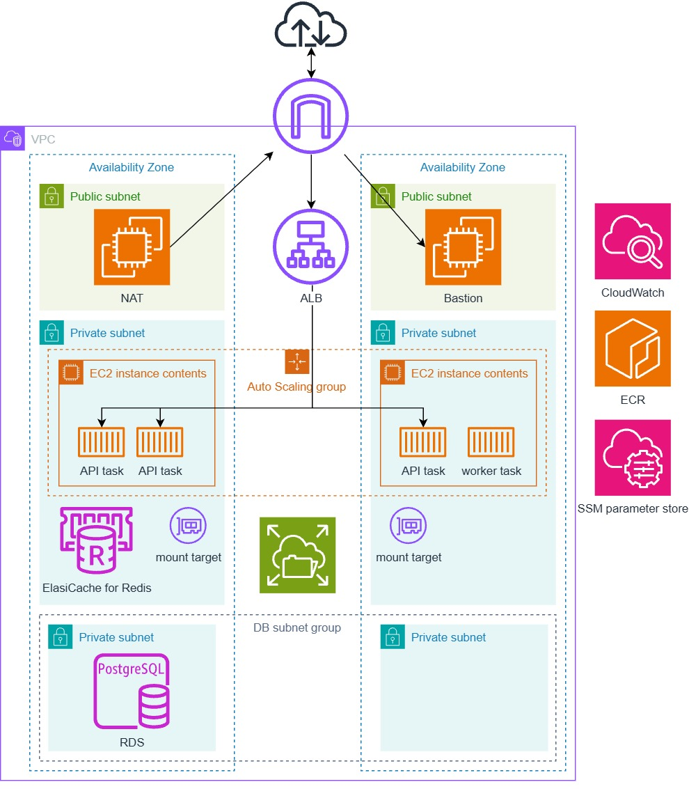

# 架構圖

- ECS Cluster type 為 EC2，設置 Auto scaling
- ALB 接收流量，target group 為 ECS API service (API 為 Laravel 專案)
- ECS worker service 不會有流量進入
- ECS log 放在 CloudWatch log
- 部署時從 ECR 拉 image、從 SSM parameter store 取得 env
- 建立 PostgreSQL RDS、ElastiCache for Redis 及 EFS
- 設置 Bastion、Bastion 方便安裝服務、部署和排錯
